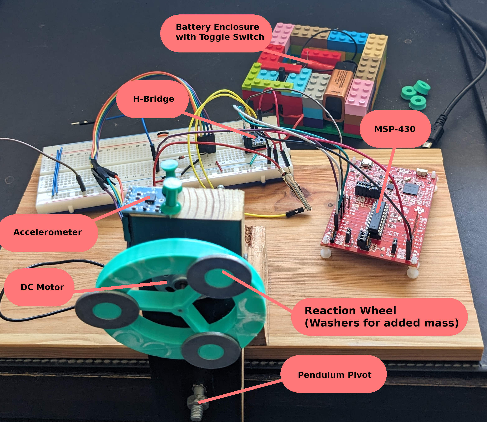
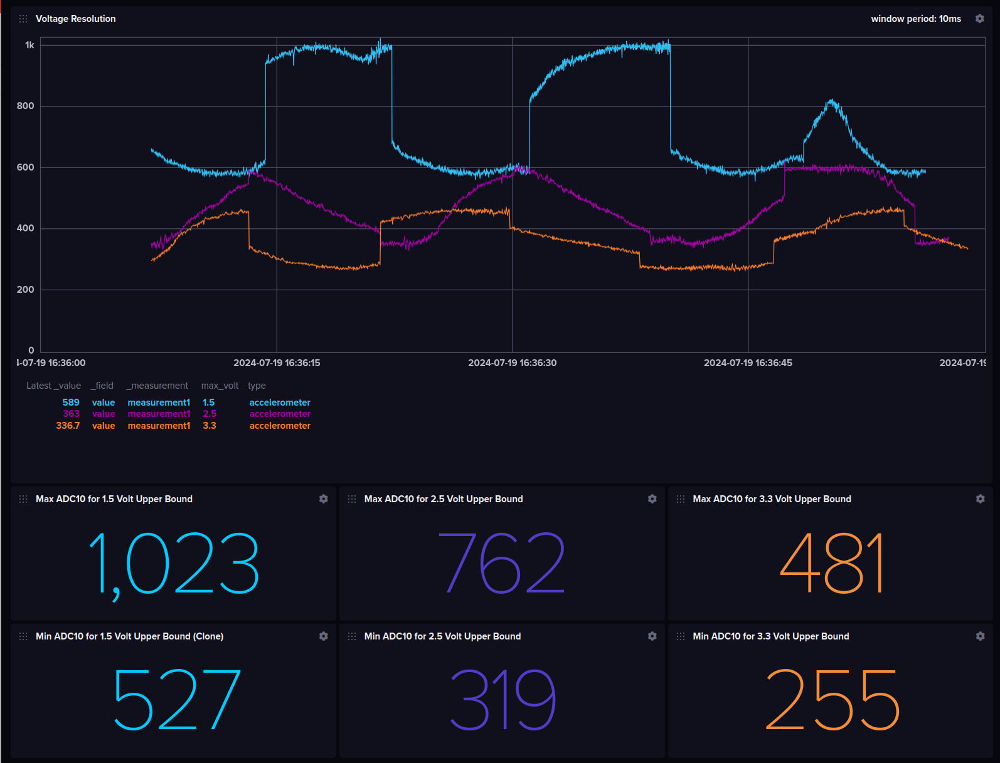

# Inverted Pendulum V1

## Objective
The objective of this project was to learn about microcontrollers and electronics by creating a self-stabilizing inverted pendulum. While the pendulum isn't self-stabilizing yet, the project provided valuable learning experiences.

## Equipment
- **Microcontroller:** TI MSP-430G2553
  - Acts as the brain of the system.
  - Reads analog data from the accelerometer.
  - Calculates the power and direction of the signal to send to the H-Bridge.
  - Generates a PWM signal for the H-Bridge.
  - Exports telemetry data using UART.
  - Programmed using Code Composer Studio.
  
- **Accelerometer:** ADXL335 3 Axis Accelerometer
  - Attached to the top of the pendulum.
  - Y component is used to measure Earth's gravitational field.
  - Outputs an analog signal between 0 and 3.3 volts.
  - Signal is read using the MSP-430’s 10-bit ADC.

- **H-Bridge:** KOOBOOK DRV8833 Motor Drive Module
  - Receives two PWM signals from the MSP-430.
  - Controls the direction and speed of the DC motor.
  - Allows for switching the direction of the DC motor purely from software.

- **Power Supply:**
  - 9-volt battery housed in a custom Lego container with an on/off switch.

## Design and Implementation

### Accelerometer Calibration
- The accelerometer doesn't directly output a "0 G" signal. Instead, it sends out a voltage somewhere between 0 and 3.3 volts. 
- Upon pressing a button on the MSP-430, the current analog value is treated as the reference for a vertical position.
- To improve resolution, a diode was used to drop the analog signal by about 0.6 volts and set the MSP-430's digital max to 1.5 volts. This improved the sensitivity in the range of -1 G to +1 G.

### ADC Range
  - The MSP-430 ADC converts analog values between 0v and 3.3v to a 10 bit number.
  - The relevant acceleration ranges between -1 G and +1 G, which is a small window of the total 0-3.3v.
  - A upper bound for the ADC is set to 1.5v, and a diode is used to drop the incoming voltage. This increase the ADC resolution in the relevant range.
  - This image shows the range of integer values for different upper voltage bounds. The orange, purple, and blue lines have an upper bound of 3.3v, 2.5v and 1.4v respectively. The accelerometer was swept though -1 G and +1 G for about a minute.

### PWM Signal Generation
- Two PWM signals are generated by the MSP-430: one for spinning the motor in a positive direction and another for the negative direction.
- Both signals are driven by the same clock interrupt vector, with one signal disabled depending on the desired direction.
- The signals are fed into an H-Bridge which drives the DC motor.

### Motor Control and Safety Features
- On startup, the entire system is disabled. Pressing the MSP-430 simultaneously sets the target accelerometer value and enables the system.
- Pressing the button again disables the system.
- The 9v battery is controller by a physical switch that can be quickly toggle.

## PID Controller
- The system displayed small oscillations around the vertical position, but these oscillations grew and became unstable over time.
- Possible reasons for failure:
  - The accelerometer is quite nosiy.
  - Vibrations in the pendulum arm are picked up by the accelerometer.
  - There's no way to isolate acceleration due to gravity from acceleration from other sources.
  - The control loop may need better tuning or different control strategies.
  - The reaction wheel may be too small to exert enough influence over the pendulum.

## Telemetry and Data Collection
- **Telemetry Export:** Each control loop cycle, the current accelerometer value and the control output to the DC motor were exported via UART.
- **Data Handling:** A Go program reads the serial data and exports it to an InfluxDB time series database. This allowed for the creation of dashboards to monitor system behavior.

## Results and Future Improvements
- The system currently fails to achieve self-stabilization, but provides valuable insights into control systems and microcontroller programming.
- **Potential Improvements:**
  - Use a rotary encoder to track pendulum arm position.
  - Use a counterweight instead of a reaction wheel.
  - Use a more powerful microcontroller or a microcontroller with a dedicated FPU
  - Refine the PID controller logic.
