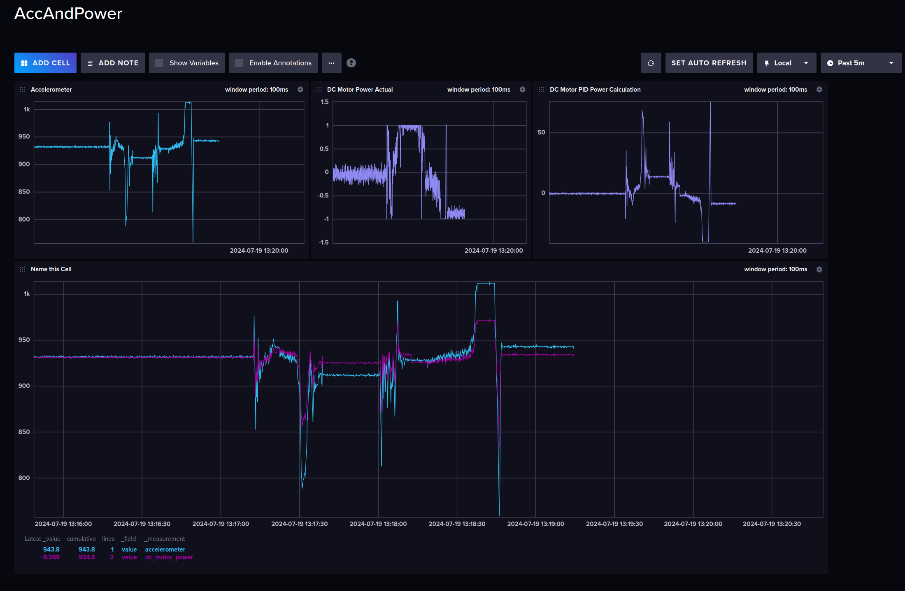

# UART Data Logger for Accelerometer and DC Motor

This program is designed to read data from an MSP430 microcontroller over a UART serial connection, process the data, and log it into an InfluxDB database. The data includes accelerometer readings and the power output intended for a DC motor. This program is useful for monitoring and analyzing the behavior of an embedded system in real-time.

## Overview

The program continuously reads UART data from a specified serial port, processes it to extract accelerometer values and power commands for a DC motor, and then writes these data points to an InfluxDB database.

### Features

- **UART Communication**: Reads data packets from a specified UART port.
- **Data Processing**: Extracts accelerometer values and DC motor power commands from the raw data stream.
- **InfluxDB Integration**: Logs the processed data into an InfluxDB instance for storage and later analysis.
- **Goroutines**: Data packets are read on a background goroutine while InfluxDB logging happens on the main goroutine.

## How It Works

1. **UART Data Streaming**: The program opens a UART port and reads incoming data in chunks. Each data packet is expected to start with the sentinel value `0xBEEF`, followed by a 16-bit integer (accelerometer value) and a 32-bit floating point number (power value).

2. **Data Extraction**: The program looks for the `0xBEEF` sentinel to identify the start of each data packet. It then extracts the accelerometer value (as a 16-bit integer) and the power command (as a 32-bit float).

3. **Data Logging**: The extracted data is sent to an InfluxDB database using the InfluxDB client library. Three data points are logged:
   - **Accelerometer Value** (`accelerometer`): The raw accelerometer reading.
   - **DC Motor Power Command** (`dc_motor_power`): The raw power command value.
   - **Actual DC Motor Power** (`real_dc_motor_power`): The power command value capped between -1 and 1, representing the actual PWM signal sent to the motor.

## Sample Influx DB Dashboard

